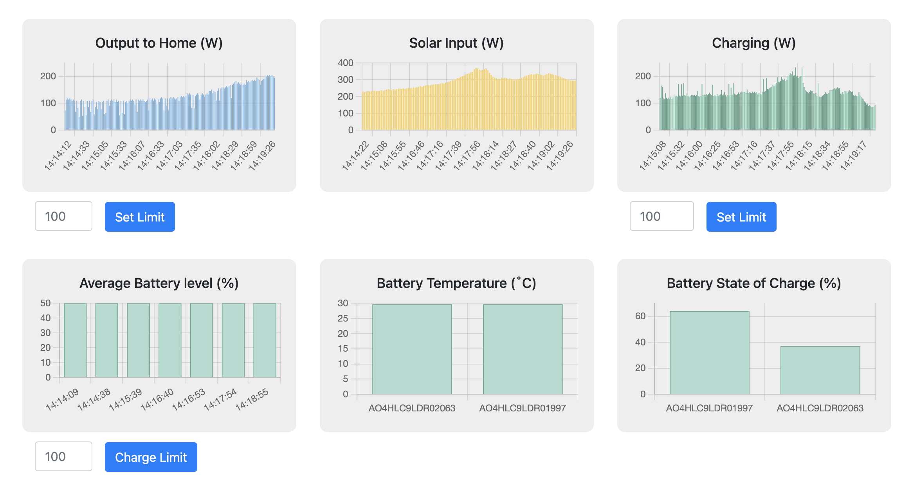

## Solarflow Statuspage and Control

The Solarflow Statuspage is an alternative to the mobile app. It gives a quick overview of the status of the hub, providing realtime data of the output to home, the current solar power generated and the battery charging power as well as the temperature nad individual battiers connected to your hub.
It also allows you manually to control the output to home and the battery charging limit.

## What is Solarflow Control

Solarflow-control is a little python script that I created as a proof of concept for steering a SolarFlow Hub without the App.
My intention was to use my existing telemetry from my smartmeter and my requirement to control charging and discharging in a better way than what is possible with the app.
Solarflow-Control is currently steering my Hub 24/7 with these capabilities:

- when there is enough solar power it charges the battery with at least 125W. If there is less solar power that goes to the battery first (battery priority) before feeding to home.
- if there is less demand from home than available solarpower the "over-production" goes to the battery.
- generally the output to home is always adjusted to what is needed. This guarantees that no solarpower is "wasted" and fed to the grid, but rather used to charge the battery.
- during night time it discharges the battery with a maximum of 145W but also adapts to the current demand

The script uses the Zendure developer MQTT telemetry data (bridged to a local MQTT broker) to make decisions. I'm using an AhoyDTU to control my micro-inverter to steer the output to home from the hub, but I have also tested adjusting that directly via the Zendure MQTT to control the hub (as one would do manually via the output to home in the App). For this to work one would need to "share" the hub with another account so that the mobile app could still be used in parallel. I haven't published that approach yet, as it adds an extra layer of complexity.

### Prerequisites
The script requires a a few prerequisites that are described [in my initial documentation for HA integration](../controlling_with_homeassistant.md). It especially depends on the local MQTT broker to get telemetry data.

